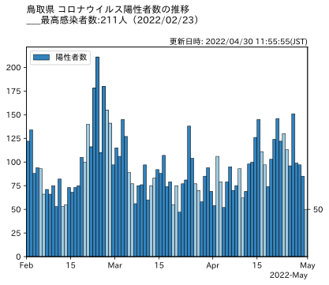
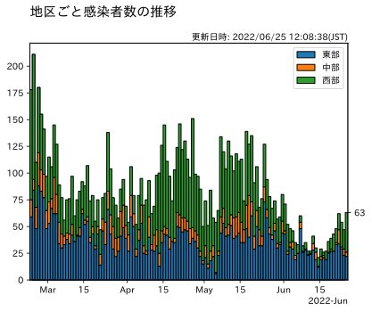
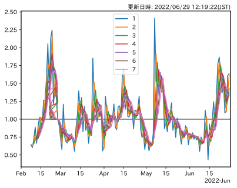

# Python×COVID-19
このページでは、Pythonを用いて鳥取県の新型コロナウイルス感染者数を毎日午前10時（JST)に自動で取得しその推移をグラフを作成し公開しています。実行環境の都合につき更新が遅れる場合があります。

ここにある内容について、いかなる責任も負えません。ご利用になられる際は、ご了承ください。
## 感染者数の推移

## 地区ごとの感染者数の推移（地区ごとの集計は，2022年２月22日から）

## 実効再生産数

### 参考にさせていただいたもの
* 奥村先生のページ
   - https://oku.edu.mie-u.ac.jp/~okumura/python/COVID-19.html
   - https://oku.edu.mie-u.ac.jp/~okumura/python/code/COVID-tokyo.py
