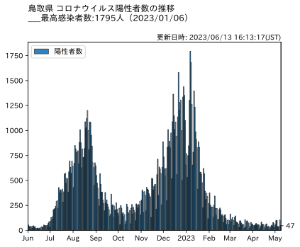
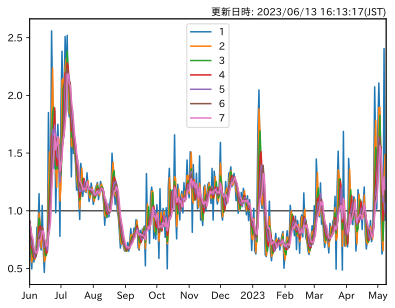

# Python×COVID-19
このページでは，Pythonを用いて鳥取県の新型コロナウイルス感染者数を毎日16時（JST)[^1]に自動で取得し,日々の推移をグラフを作成し公開しています。

[^1]: 厚生労働省より取得：https://covid19.mhlw.go.jp/public/opendata/newly_confirmed_cases_daily.csv

実行環境の都合につき更新が遅れる場合があります。

ここにある内容について，いかなる責任も負えません。ご利用になられる際は，ご了承ください。
## 感染者数の推移

## 実効再生産数

### 実行再生産数とは

一人のコロナウィルス感染者がつぎに平均で何人にうつすかをしめす指標のことで実効再生産数が1を超えているときは，増加傾向であることを示しています。

### 参考にさせていただいたもの
* 奥村先生のページ
   - https://oku.edu.mie-u.ac.jp/~okumura/python/COVID-19.html
   - https://oku.edu.mie-u.ac.jp/~okumura/python/code/COVID-tokyo.py
